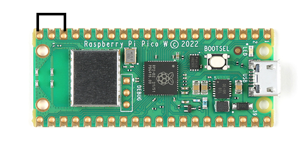
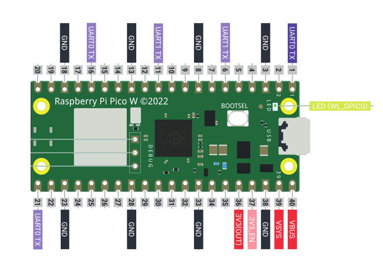

# Pico ICARUS
Using a Raspberry Pi Pico W to listen for NMEA messages and convert value for pressure altitude to ICARUS format and send out RS232.
MicroPython v1.21.0 on 2023-10-06; Raspberry Pi Pico W with RP2040

## How to use
Flash a RPI Pico W with micropython. Modify your secrets.json file to include the wireless settings of your NMEA source. Modify the secrets file to the RS232 baudrate and UDP port NMEA traffic is sent on.  Copy the boot.py, main.py, preload.py and secrets.json to the Pico using Thonny or equivalent.  LED will toggle each time it receives PGRMZ messaging. 

### boot.py
This file tells the Pico which file to load when booting

### preload.py
This file sets a boolean if GPIO pin 15 is grounded. If True, the PICO main.py file will not run the program and allow you to modify the settings without having to CTRL-C or reflash. 

### main.py
This file checks for the preload boolean and if false will run the program.  First the secrets.json file is opened for user settings.  Serial ports are configured (default 9600) on UART0 and UART1. Wifi is established and listening on UDP port 2000. The program uses asyncio to run two threads.  1) To listen on port 2000 for NMEA $PGRMZ message and cache the value; 2) Every 1 seconds sends the cached pressure altitude value in ICARUS format out the serial ports. 

### secrets.json
Used to modify wifi settings, serial baudrates, and NMEA UDP port.

## External Connection
Power device with standard USB mini or hardwire in accordance with Raspberry Pi Pico W documentation. Ensure ground is shard with the device sending ICARUS data to on the RS232 (DSub connection).  Before the device receives a PGRMZ message it will send a test pressure altitude of 02121.  This can be changed or left blank in the code.

##### UART0 TX Ports
- GP0 
- GP12
- GP15
##### UART1 TX Ports
- GP4
- GP8

## Testing
Highly recomended you test the program with Thonny to verify wifi connectivity and received altitude information is received.  Alse test RS232 with USB to serial adapter and putty. Connect one of the TX ports to the RX port Dsub9 pin 2 and ground pin5. 
